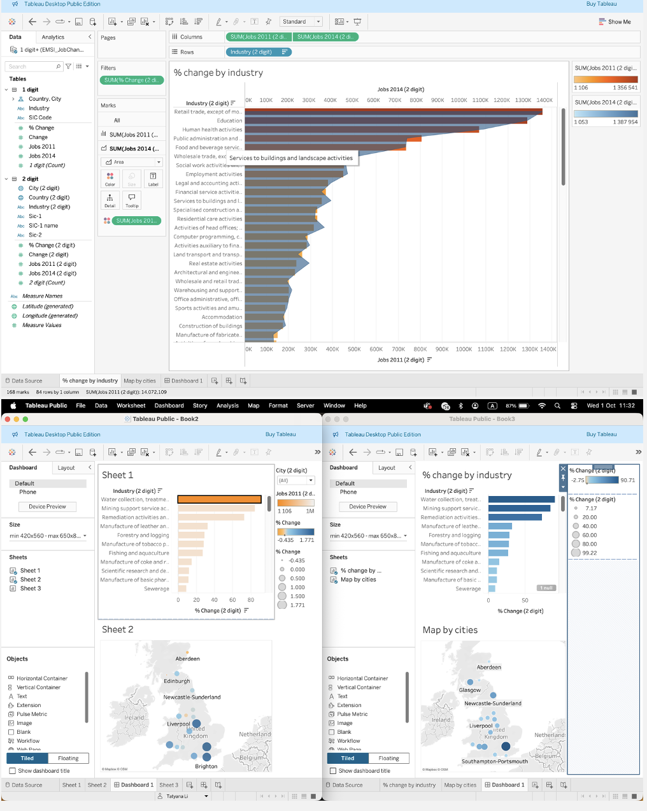

# class_workbooks

It contains all the class work we have done so far:
1. Tatyana Li_DataTechWorkbook.docx - has self work i've done in a week 1 with Excel sheets, creating pivot tables and some other simple analysis skills.

2. Tatyana_Li_Workbook_Week_2.docx - week 2 was about such an advanced tools in data analysis as PowerBi and Tableau.

This is Tableau dashboards example, which shows  an analysis to find trends and key information that could be used by an organisation for future projects:

On Power BI i've learned how to design a Report in Power BI Desktop:

3. Tatyana_Li_DataTec_Workbook_wk3_SQL.docx - a week of SQL and mySQL and an example of query usage.

Display Columns with Limit (First 10 Rows):
SELECT name, population
FROM city
ORDER BY Population DESC
LIMIT 10;

4. Tatyana Li_Workbook_Week_4.docx - all this week was about cloud services, where we learned more detailed Microsoft Azure.

I've learned different models of Azure cloud, the way to create them and query by using SQL.

5. Tatyana_Li_Workbook_Week_5.docx - Python week, with lot of coding and personal activity.

On the example below, i've showed number of students by marks in class.

